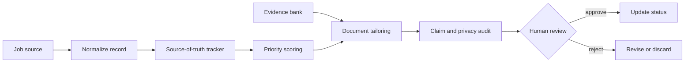

# AI-Assisted Job Search Workflow

> A public, synthetic reference implementation for evidence-backed job discovery, application tailoring, document validation, and human-controlled tracking.

This is a recruiter-facing engineering case study. It shows how I translated a job-search problem into explicit data contracts, explainable ranking, evidence selection, privacy checks, and review gates while directing AI-assisted implementation and validating the resulting behavior. It does not claim unaided authorship of every line or any employment outcome.

## Workflow problem

Job-search work becomes unreliable when postings, evidence, tailored documents, and application status live in disconnected notes. The system behind this case study used a structured source of truth to make ranking, evidence selection, document generation, and review gates explicit.

This public edition is not a mass-application bot. It demonstrates a review-first workflow and does not submit applications.

## What a reviewer can inspect

- Structured job records with fit, priority, and status fields.
- Deterministic prioritization with explainable scoring.
- An evidence bank that maps approved claims to source IDs.
- Resume-variant rendering from synthetic evidence only.
- Document audits that block unsupported or private claims.
- Human approval gates before any external action.
- Synthetic applications and fictional candidate data.

The core implementation is intentionally small: `src/prioritize.js` ranks jobs, `src/evidence.js` admits only marked synthetic evidence, `src/documents.js` renders and audits a representative document variant, and `src/gates.js` fails closed until every pre-submit condition is explicit.

## Architecture



See [CASE_STUDY.md](CASE_STUDY.md) and [docs/architecture.md](docs/architecture.md).

## Synthetic data and privacy boundary

Every fixture is marked `synthetic: true`. Fixtures use fictional companies such as Northstar Health and Cedar Analytics, fictional roles and salaries, and `Example Candidate`. They are not copied from a live tracker. The intentionally unsupported evidence record has no approved surface and exists to prove that unsupported claims are omitted rather than promoted.

## Run it

```powershell
npm test
```

The tests run offline against the synthetic fixtures and cover ranking determinism, evidence provenance, privacy auditing, duplicate-ID handling, regex-state safety, and human approval gates.

## Privacy and limits

Read [PRIVACY.md](PRIVACY.md), [SECURITY.md](SECURITY.md), and [docs/privacy-design.md](docs/privacy-design.md). The implementation does not include real applications, private prompts, live connectors, submission automation, employment outcomes, interview outcomes, time-saved claims, or application-volume claims.

## Human-controlled boundary

The workflow never submits an application, sends a message, creates a referral, or performs another consequential external action. It stops at a review-ready state until a human has confirmed the job is active, the packet is audited, claims are supported, sensitive fields are resolved, required files are present, pre-submit validation is complete, and human review is explicit.
