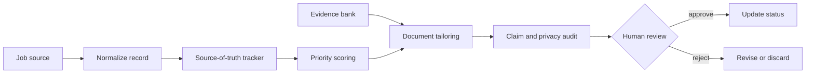

# AI-Assisted Job Search Workflow

> A synthetic, inspectable reference implementation for evidence-backed job discovery, application tailoring, document validation, and human-controlled tracking.

## Workflow problem

Job-search work becomes unreliable when postings, evidence, tailored documents, and application status live in disconnected notes. The system behind this case study used a structured source of truth to make ranking, evidence selection, document generation, and review gates explicit.

This public edition is not a mass-application bot. It demonstrates a review-first workflow and does not submit applications.

## What it demonstrates

- Structured job records with fit, priority, and status fields.
- Deterministic prioritization with explainable scoring.
- An evidence bank that maps approved claims to source IDs.
- Resume-variant rendering from synthetic evidence only.
- Document audits that block unsupported or private claims.
- Human approval gates before any external action.
- Synthetic applications and fictional candidate data.

## Architecture



See [CASE_STUDY.md](CASE_STUDY.md) and [docs/architecture.md](docs/architecture.md).

## Synthetic data

Fixtures use fictional companies such as Northstar Health and Cedar Analytics, fictional roles and salaries, and `Example Candidate`. They are not copied from a live tracker.

## Run it

```powershell
npm test
```

The tests run offline against the synthetic fixtures.

## Privacy and limits

Read [PRIVACY.md](PRIVACY.md), [SECURITY.md](SECURITY.md), and [docs/privacy-design.md](docs/privacy-design.md). The implementation does not include real applications, private prompts, live connectors, submission automation, employment outcomes, interview outcomes, time-saved claims, or application-volume claims.

## Lessons learned

The valuable automation boundary is not “apply everywhere.” It is a traceable chain from source-of-truth data to evidence-backed documents, with a human gate before consequential actions.
