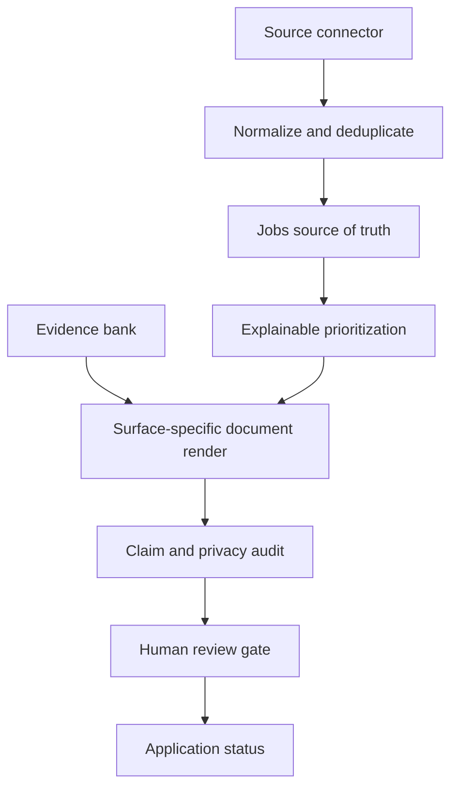

# Architecture

```mermaid
flowchart TD
  Source[Source connector] --> Normalize[Normalize and deduplicate]
  Normalize --> Jobs[Jobs source of truth]
  Jobs --> Rank[Explainable prioritization]
  Evidence[Evidence bank] --> Render[Surface-specific document render]
  Rank --> Render
  Render --> Audit[Claim and privacy audit]
  Audit --> Review[Human review gate]
  Review --> Status[Application status]
```

The public implementation keeps the seams small: ranking, evidence selection, document rendering, and approval gates can be tested independently.
