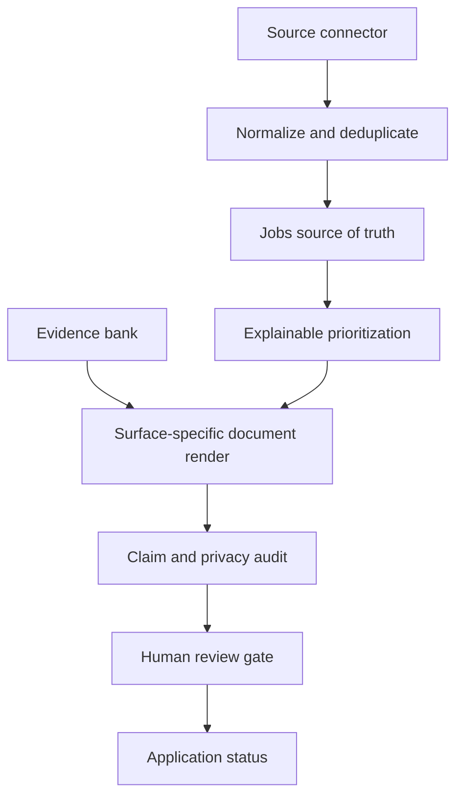

# Architecture

The public implementation keeps the seams small: ranking, evidence selection, document rendering, and approval gates can be tested independently. Ranking uses tier weights S=30, A=20, B=10, C=0 plus fit score and a 10-point active bonus; active jobs sort before archived jobs, then score and stable ID break ties. Approval fields are strict booleans and missing or malformed values fail closed.
